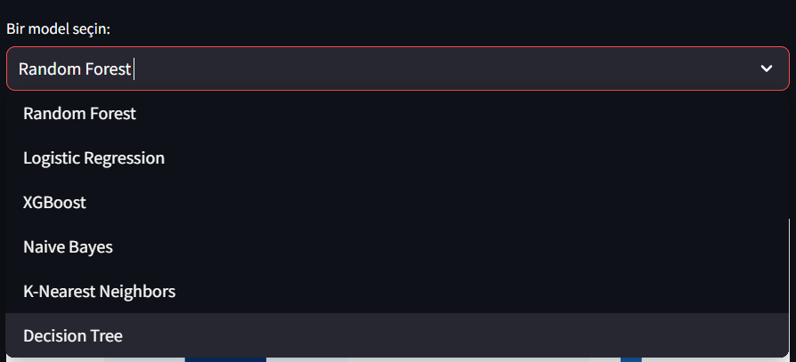
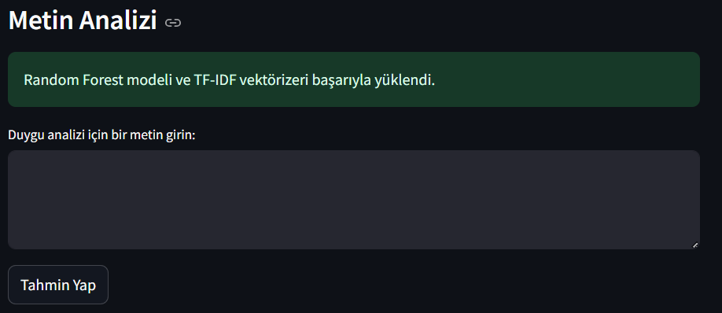

# Duygu Analizi (Emotion Classification)

Bu proje, belirli bir duygu analizi veri seti üzerinde 6 farklı model eğitilerek, yorumların duygu kategorilerine ayrılmasını amaçlamaktadır. Proje, çeşitli algoritmaların başarı oranlarını değerlendirerek en iyi performansı sağlayan modeli belirler. Eğitim sonuçları bir arayüz aracılığıyla görselleştirilmiş ve kullanıcı dostu bir analiz platformu sunulmuştur.

---

## 🚀 Proje Özeti
- **Hedef**: Kullanıcı yorumlarını duygu kategorilerine ayırmak. (Örn: mutluluk, üzüntü, korku, vb.)
- **Modeller**:
  - Random Forest
  - Logistic Regression
  - XGBoost
  - Naive Bayes
  - K-Nearest Neighbors (KNN)
  - Decision Tree
- **Değerlendirme**:
  - Başarı oranları (accuracy), confusion matrix ve metrik görselleri arayüzde sunulmaktadır.
  - En iyi model, doğruluk ve diğer metriklere göre belirlenmiştir.

---

## 🛠️ Kullanılan Teknolojiler ve Kütüphaneler
- **Python**: Proje programlama dili.
- **Streamlit**: Sonuçları görselleştirmek ve kullanıcı dostu bir arayüz sağlamak için kullanıldı.
- **Scikit-learn**: Makine öğrenimi algoritmaları ve değerlendirme metrikleri.
- **XGBoost**: Gelişmiş bir gradient boosting algoritması.
- **NLTK**: Doğal dil işleme adımları için kullanıldı.
- **Matplotlib & Seaborn**: Görselleştirme araçları.

---

## 📦 Kurulum Adımları

### 1. Gerekli Kütüphaneleri Yükleyin
Proje gereksinimlerini yüklemek için aşağıdaki komutu çalıştırın:
```bash
pip install -r requirements.txt
```
### 2. Veri Setini İndirin ve Eğitim Yapın
Proje, HuggingFace dair-ai/emotion veri seti ile çalışmaktadır. Eğitim işlemini başlatmak için:
```bash
python main.py
```
Bu işlem sonunda eğitilmiş modeller ve TF-IDF vektörizer kaydedilecektir.

### 3. Arayüzü Çalıştırın
Eğitim sonrası sonuçları ve görselleri incelemek için Streamlit arayüzünü başlatın:

```bash
python -m streamlit run ui.py
```
## 📊 Arayüz Özellikleri
Model Seçimi: Kullanıcı, 6 farklı modelden birini seçerek ilgili sonuçları görebilir.
Görselleştirme:
Confusion matrix
Precision, recall, ve F1-score grafikleri
ROC eğrisi
Canlı Metin Analizi: Kullanıcı tarafından girilen bir metin analiz edilerek tahmin edilen duygu gösterilir.
📁 Proje Yapısı
```plaintext
├── model_weights/               # Eğitilmiş modeller
├── model_plots/                 # Eğitim sonrası üretilen görseller
├── requirements.txt             # Gerekli kütüphaneler
├── main.py                      # Model eğitimi ve değerlendirme
├── ui.py                        # Streamlit arayüzü
├── README.md                    # Proje hakkında bilgi
└── tfidf_vectorizer.pkl         # Kaydedilmiş TF-IDF vektörizer
```
🤖 Modellerin Performansı
Eğitim sırasında elde edilen sonuçlar, doğruluk oranları ve metrikler arayüzde detaylı şekilde sunulmaktadır. Örnek bir modelin başarısı:

Doğruluk: %92.5
ROC Eğrisi: AUC değeri %90 üzerinde.
💡 Katkıda Bulunma
Herhangi bir iyileştirme öneriniz veya katkınız varsa, lütfen bir pull request açın veya bir issue oluşturun. Geri bildirimlerinizi bekliyoruz!

## 📄 Lisans
Bu proje MIT Lisansı altında yayınlanmıştır. Detaylar için LICENSE dosyasına göz atabilirsiniz.

## ✨ Ekran Görüntüleri
### Arayüz:

#### Model Seçimi Görüntüsü


#### Canlı Tahmin Görüntüsü

